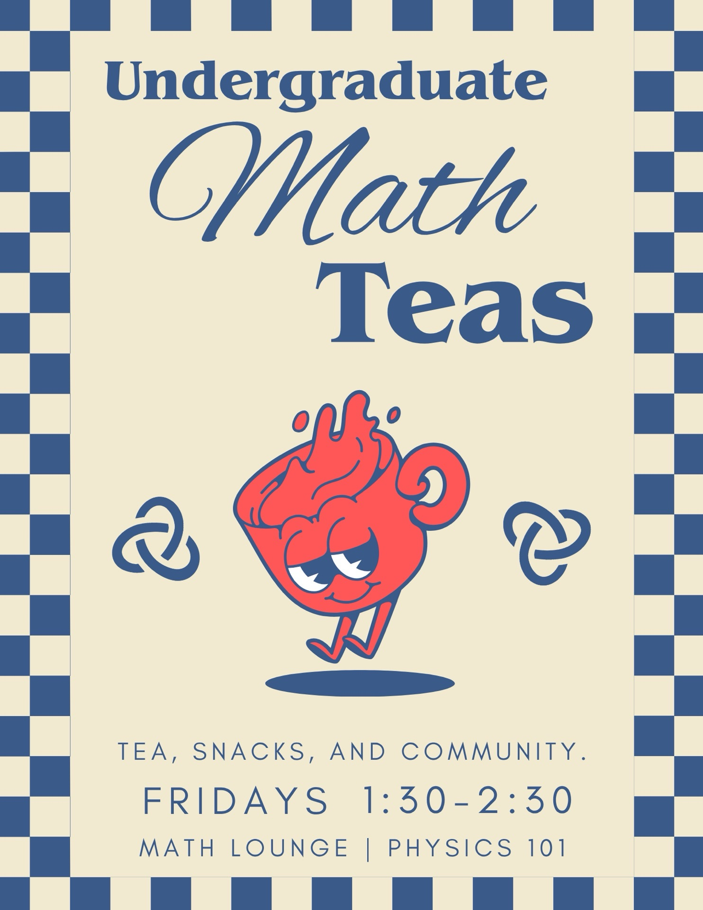

This page contains auxiliary information for the [Duke Math Community Team](https://math.duke.edu/duke-math-community-team), specifically
information pertaining to undergrad events and activities.

## Undergrad Math Teas

The community team runs **Undergrad Math Teas**, now **weekly** on **Fridays**, from **1:30-2:30pm** in **Physics 101** (Math Lounge).
These are fun community events with snacks, fellow math enthusiasts to chat with, and occasional structured programming. 
Grad students, postdocs, and faculty are welcomed to attend. (flyer curtesy of [Ethan Fazal](https://www.linkedin.com/in/ethan-fazal/)).

<a href="files/math/math-tea-flyer-f26.jpg" target="_blank" rel="noopener noreferrer">
  
</a>


## Math Undergrad Mini-Colloquia

We are running a new series of undergrad talks called the **Math Undergrad Mini-Colloquia**.
These happen **biweekly**, during the aforementioned Math Teas on **Fridays**, from **1:30-2:30pm** in **Physics 101** (Math Lounge).
The dates for Fall 2026 are below. All undergrads are welcomed to speak! Sign up to talk [here](https://duke.is/math-undergrad-talks). 
All (including non-undergrads) are welcome to attend.

### Upcoming

<div id="mini-colloquia-upcoming" class="mc-section"></div>

### Past

<div id="mini-colloquia-past-container"></div>


<script>

const miniColloquiaData = {
  'upcoming': [

    {
      date: 'October 2, 2026',
      title: 'Stochastic localization and connections to diffusion models',
      presenter: 'Derek Wang',
      keywords: ['stochastic analysis', 'sampling']
    },

    {
      date: 'October 16, 2026',
      title: 'Complex analysis and the Riemann zeta function',
      presenter: 'Yashraj Vishwakarma',
      keywords: ['complex analysis', 'number theory']
    },

    {
      date: 'October 30, 2026',
      title: '??',
      presenter: '??',
      keywords: []
    },

    {
      date: 'November 6, 2026',
      title: 'Mechanics on Lie Groups',
      presenter: 'Shan Tong',
      keywords: ['mathematical physics', 'differential geometry', 'dynamical systems']
    },

    {
      date: 'November 20, 2026',
      title: '??',
      presenter: '??',
      keywords: []
    },

    {
      date: 'December 4, 2026',
      title: 'Applications of rough paths in physics and machine learning',
      presenter: 'Yashraj Vishwakarma',
      keywords: ['stochastic analysis']
    },
  ],

  'Fall 2026': [
    
  ],

};


function createMCItem(itemData, index) {
  const el = document.createElement('div');
  el.className = 'mc-item';
  el.tabIndex = 0;

  el.innerHTML = `
    <div class="mc-summary" aria-hidden="false">
      <p class="mc-date">${itemData.date}</p>
      <p class="mc-title">${itemData.title}</p>
    </div>

    <div class="mc-details" id="mc-details-${index}">
      <div>
        <p class="mc-presenter"><strong>Presenter:</strong> ${itemData.presenter}</p>
      </div>
      <div>
        <p class="mc-keywords"><strong>Keywords:</strong> <span>${(itemData.keywords||[]).join(', ')}</span></p>
      </div>
    </div>
  `;

  el.addEventListener('click', (e) => {
    // avoid toggling when clicking inside links or selectable areas in future
    if (e.target.tagName.toLowerCase() === 'a') return;
    el.classList.toggle('mc-open');
  });

  el.addEventListener('keydown', (e) => {
    if (e.key === 'Enter' || e.key === ' ') {
      e.preventDefault();
      el.classList.toggle('mc-open');
    }
  });

  return el;
}


function initializeMiniColloquia() {
  // Handle upcoming section
  const upcomingSection = document.getElementById('mini-colloquia-upcoming');
  if (upcomingSection && miniColloquiaData.upcoming) {
    const list = document.createElement('div');
    list.className = 'mc-list';
    miniColloquiaData.upcoming.forEach((item, idx) => {
      list.appendChild(createMCItem(item, idx));
    });
    upcomingSection.appendChild(list);
  }

  // Handle past semesters - dynamically create dropdowns
  const pastContainer = document.getElementById('mini-colloquia-past-container');
  if (pastContainer) {
    Object.entries(miniColloquiaData).forEach(([sectionName, items]) => {
      if (sectionName !== 'upcoming' && items.length > 0) {
        const details = document.createElement('details');
        const summary = document.createElement('summary');
        summary.textContent = sectionName;
        details.appendChild(summary);

        const section = document.createElement('div');
        section.className = 'mc-section';
        const list = document.createElement('div');
        list.className = 'mc-list';
        items.forEach((item, idx) => {
          list.appendChild(createMCItem(item, idx));
        });
        section.appendChild(list);
        details.appendChild(section);

        pastContainer.appendChild(details);
      }
    });
  }
}


document.addEventListener('DOMContentLoaded', initializeMiniColloquia);
</script>

## Math Games

Here I've compiled some math-themed versions of board/party games. I only provide the "cards" or equivalent textual components of each game.
You probably need a physical set to actually play some of these. 

### Math Codenames

Words curtesy of [Ethan Fazal](linkedin.com/in/ethan-fazal).

```{=html}
<div id="cn-container" class="cn-container">
  <div class="cn-controls">
    <button id="cn-start" class="cn-start">Start game</button>
    <input id="cn-clue" class="cn-clue" type="number" min="1" max="9" placeholder="#" aria-label="Number of cards called by spymaster">
    <button id="cn-next" class="cn-start" disabled>Next turn</button>
    <span id="cn-status" class="cn-status"></span>
  </div>
  <div id="cn-board" class="cn-board"></div>
  <div class="cn-key-controls">
    <button id="cn-key-toggle" class="cn-start">Check Key Card</button>
  </div>
  <div id="cn-key" class="cn-key" hidden></div>
</div>

<script>

const cnWords = [
  'Power', 'Root', 'Function', 'Table', 'Limit', 'Series', 'Plane', 'Ring',
  'Field', 'Graph', 'Model', 'Random', 'Proof', 'Degree', 'Vector', 'Base',
  'Theorem', 'Law', 'Letter', 'Change', 'Sum', 'Continuous', 'Square', 'Circle',
  'Area', 'Wave', 'Half', 'Equation', 'Inequality', 'Time', 'Cross', 'Decay',
  'Growth', 'Solution', 'Intersect', 'Distribution', 'Union', 'Set', 'Quad',
  'Term', 'Right', 'Angle', 'Line', 'Skew', 'Mid', 'Point', 'Coordinate',
  'Axis', 'Construction', 'Complex', 'Polar', 'Rule', 'Differentiate', 'Integral',
  'Result', 'Constant', 'Second', 'Prime', 'Dual', 'Basis', 'Anti', 'Approximate',
  'Taylor', 'Zero', 'Maximum', 'Minimum', 'Local', 'Global', 'Slope', 'Rate',
  'Tangent', 'Curve', 'Peak', 'Concave', 'Convex', 'Matrix', 'Commute', 'Transpose',
  'Algebra', 'Linear', 'System', 'Triangle', 'Product', 'Dot', 'Inner', 'Free',
  'Projection', 'Normal', 'Simple', 'Reduce', 'Gauss', 'Eliminate', 'Textbook',
  'Eigen', 'Lambda', 'Space', 'Span', 'Dimension', 'Transform', 'Identity',
  'Inverse', 'Map', 'Scale', 'Diagonal', 'Independent', 'Symmetry', 'Rank',
  'Null', 'Kernel', 'Scalar', 'Green', 'Surface', 'Volume', 'Level', 'Saddle',
  'Gradient', 'Flow', 'Flux', 'Path', 'Partial', 'Boundary', 'Direction',
  'Implicit', 'Diverge', 'Height', 'Discrete', 'Probability', 'Converge',
  'Number', 'Uniform', 'Count', 'Event', 'Fair', 'Risk', 'Sample', 'Draw',
  'Condition', 'Average', 'Vary', 'Process', 'Dynamic', 'Stable', 'Heat',
  'Initial', 'Fourier', 'Source', 'Sink', 'Center', 'Asymptote', 'Resonate',
  'Euler', 'Factor', 'Even', 'Odd', 'Mod', 'Cycle', 'Division', 'Algorithm',
  'Class', 'Order', 'Sub', 'Element', 'Finite', 'Infinity', 'Axiom', 'Bound',
  'Smooth', 'Jump', 'Delta', 'Metric', 'Small', 'Parameter', 'Large', 'First',
  'Layer', 'Similar', 'Method', 'Perturb', 'Calculus', 'Test', 'Hypothesis',
  'Experiment', 'Shock', 'Ratio', 'Decimal', 'Fraction', 'Proportion', 'Total',
  'Edge', 'Sequence', 'Relation', 'Data', 'Information', 'Predict', 'Node',
  'Tree', 'Sort', 'Logic', 'Input', 'Output', 'Image', 'Code', 'Error', 'Quantum',
  'Correct', 'Numerics',
];

const cnLabels = {
  red: 'Red',
  blue: 'Blue',
  bystander: 'Bystander',
  assassin: 'Assassin',
};

function cnShuffle(arr) {
  const a = arr.slice();
  for (let i = a.length - 1; i > 0; i--) {
    const j = Math.floor(Math.random() * (i + 1));
    [a[i], a[j]] = [a[j], a[i]];
  }
  return a;
}

function createCnCard(word, type) {
  const cardEl = document.createElement('div');
  cardEl.className = `cn-card cn-${type}`;
  cardEl.innerHTML = `
    <div class="cn-card-inner">
      <div class="cn-card-front">
        <p>${word}</p>
      </div>
      <div class="cn-card-back">
        <p>${word}</p>
        <span class="cn-label">${cnLabels[type]}</span>
      </div>
    </div>
  `;

  cardEl.addEventListener('click', function() {
    cnGuess(this, type);
  });

  return cardEl;
}

let cnState = null;

function cnOtherTeam(team) {
  return team === 'red' ? 'blue' : 'red';
}

function cnCanGuess() {
  return !cnState.winner && !cnState.turnOver && cnState.clue >= 1;
}

function cnGuess(cardEl, type) {
  // a guess can't be taken back, so cards only flip one way
  if (!cnCanGuess() || cardEl.classList.contains('cn-card-flipped')) return;

  cardEl.classList.add('cn-card-flipped');
  cnState.guesses++;
  document.getElementById('cn-clue').disabled = true;

  if (type === 'red' || type === 'blue') {
    cnState.remaining[type]--;
    if (cnState.remaining[type] === 0) cnState.winner = type;
  } else if (type === 'assassin') {
    cnState.winner = cnOtherTeam(cnState.turn);
  }

  if (type === cnState.turn) {
    // up to one bonus guess beyond the called number
    cnState.correct++;
    if (cnState.correct >= cnState.clue + 1) cnState.turnOver = true;
  } else {
    cnState.turnOver = true;
  }

  cnUpdateUI();
}

function cnNextTurn() {
  cnState.turn = cnOtherTeam(cnState.turn);
  cnState.clue = 0;
  cnState.correct = 0;
  cnState.guesses = 0;
  cnState.turnOver = false;

  const clue = document.getElementById('cn-clue');
  clue.value = '';
  clue.disabled = false;

  cnUpdateUI();
}

function cnUpdateUI() {
  const team = cnState.winner || cnState.turn;
  const status = document.getElementById('cn-status');
  status.textContent = cnState.winner ? `${cnLabels[team]} wins!` : `${cnLabels[team]} turn`;
  status.className = `cn-status cn-status-${team}`;

  // any guess lets the team stop early; the board freezes on its own when the turn is over
  const next = document.getElementById('cn-next');
  next.disabled = !!cnState.winner || cnState.guesses === 0;
  next.className = `cn-start cn-next-${cnOtherTeam(cnState.turn)}`;
  document.getElementById('cn-board').classList.toggle('cn-frozen', !cnCanGuess());
  if (cnState.winner) document.getElementById('cn-clue').disabled = true;
}

function renderCnKey(key, wildTeam) {
  const keyEl = document.getElementById('cn-key');
  keyEl.innerHTML = '';
  key.forEach(type => {
    const cell = document.createElement('div');
    cell.className = `cn-key-cell cn-${type}`;
    keyEl.appendChild(cell);
  });

  // frame shows the starting team's color
  keyEl.className = `cn-key cn-key-${wildTeam}`;
}

function dealCodenames() {
  // the wildcard goes to a random team, which then has 9 cards and goes first
  const wildTeam = Math.random() < 0.5 ? 'red' : 'blue';

  const key = cnShuffle([
    ...Array(8).fill('red'),
    ...Array(8).fill('blue'),
    ...Array(7).fill('bystander'),
    'assassin',
    wildTeam,
  ]);
  const words = cnShuffle(cnWords).slice(0, 25);

  const board = document.getElementById('cn-board');
  board.innerHTML = '';
  key.forEach((type, i) => {
    board.appendChild(createCnCard(words[i], type));
  });

  renderCnKey(key, wildTeam);
  document.getElementById('cn-key').hidden = true;
  document.getElementById('cn-key-toggle').textContent = 'Check Key Card';

  cnState = {
    turn: wildTeam,
    remaining: { red: 8, blue: 8 },
    clue: 0,
    correct: 0,
    guesses: 0,
    turnOver: false,
    winner: null,
  };
  cnState.remaining[wildTeam]++;

  const clue = document.getElementById('cn-clue');
  clue.value = '';
  clue.disabled = false;

  cnUpdateUI();
}

document.addEventListener('DOMContentLoaded', function () {
  document.getElementById('cn-start').addEventListener('click', dealCodenames);
  document.getElementById('cn-next').addEventListener('click', cnNextTurn);

  document.getElementById('cn-clue').addEventListener('input', function () {
    cnState.clue = parseInt(this.value) || 0;
    cnUpdateUI();
  });

  document.getElementById('cn-key-toggle').addEventListener('click', function () {
    const keyEl = document.getElementById('cn-key');
    keyEl.hidden = !keyEl.hidden;
    this.textContent = keyEl.hidden ? 'Check Key Card' : 'Hide Key Card';
  });

  dealCodenames();
});

</script>
```


### 5 Second Rule

```{=html}
<div id="fsr-container" class="fsr-container">
  <div id="fsr-menu" class="fsr-menu"></div>
  <div id="fsr-content" class="fsr-content">
    <div id="fsr-cards" class="fsr-cards"></div>
  </div>
</div>

<script>

let currentTheme = null;
let currentIndex = 0;

const fsrThemes = {
  'General': [
    { front: 'Name <strong>3</strong> branches of mathematics categorized as <strong>algebra</strong>', back: '<strong>Sample Responses:</strong> algebraic topology, algebraic geometry, algebraic number theory' },
    { front: 'Name <strong>3</strong> branches of mathematics categorized as <strong>analysis</strong>', back: '<strong>Sample Responses:</strong> real analysis, complex analysis, functional analysis, stochastic analysis' },
    { front: 'Name <strong>3</strong> branches of <strong>applied mathematics</strong>', back: '<strong>Sample Responses:</strong> mathematical biology, mathematical physics, scientific computing, algorithms' },
    { front: 'Name <strong>3 transforms</strong> of any kind', back: '<strong>Sample Responses:</strong> Legendre, Fourier, Laplace' },
    { front: 'Name <strong>3</strong> objects one may refer to as <strong>conjugate</strong> in any sense', back: '<strong>Sample Responses:</strong> conjugate variables, roots of polynomials, complex conjugates, conjugate matrices, conjugate transpose' },
    { front: 'Name <strong>3 spaces</strong> of any kind', back: '<strong>Sample Responses:</strong> vector space, metric space, inner product space, Hilbert space, Banach space, tangent space, phase space' },
    { front: 'Name <strong>3</strong> objects one may refer to as <strong>normal</strong> in any sense', back: '<strong>Sample Responses:</strong> matrices, subgroups, orthogonal lines, modes' },
    { front: 'Name <strong>3</strong> properties any function might have', back: '<strong>Sample Responses:</strong> injectivity, surjectivity, bijectivity' },
    { front: 'Name <strong>3 inequalities</strong> of any kind', back: '<strong>Sample Responses:</strong> AM-GM, Cauchy-Schwarz inequality, triangle inequality, Markov\'s inequality' },
    { front: 'Name <strong>3</strong> things that begin with <strong>eigen-</strong>', back: '<strong>Sample Responses:</strong> eigenvector, eigenvalue, eigenspace, eigenfunction, eigenmodes' },
    { front: 'Name <strong>3</strong> ways to use a lower-case <strong>delta</strong> symbol', back: '<strong>Sample Responses:</strong> Kronecker delta, Dirac delta, a small angle, variation of a functional' },
    { front: 'Name <strong>3</strong> famous <strong>constants</strong> in mathematics', back: '<strong>Sample Responses:</strong> Golden Ratio, e, pi' },
    { front: 'Name <strong>3</strong> <strong>trigonometric</strong> functions', back: '<strong>Sample Responses:</strong> sine, cosine, tangent' },
    { front: 'Name <strong>3</strong> ways to solve a <strong>quadratic equation</strong> with real coefficients', back: '<strong>Sample Responses:</strong> factoring, quadratic formula, completing the square, polynomial division' },
    { front: 'Name <strong>3</strong> types (in some sense) of <strong>proofs</strong>', back: '<strong>Sample Responses:</strong> by construction, by contradiction, by induction' },
  ],

  'People': [
    { front: 'Name <strong>3</strong> mathematicians considered to be important figures in <strong>algebra</strong>', back: '<strong>Sample Responses:</strong> Galois, Abel, Noether, Lagrange, Gauss' },
    { front: 'Name <strong>3</strong> mathematicians considered to be important figures in <strong>analysis</strong>', back: '<strong>Sample Responses:</strong> Cauchy, Weierstrass, Riemann, Lebesgue, Leibniz, Hilbert, Banach' },
    { front: 'Name <strong>3</strong> mathematicians considered to be important figures in <strong>geometry</strong>', back: '<strong>Sample Responses:</strong> Grothendieck, Riemann, Poincare, Minkowski' },
    { front: 'Name <strong>3</strong> things named after <strong>Euler</strong>', back: '<strong>Sample Responses:</strong> Euler\'s identity, Euler-Lagrange equations, Eulerian circuit, Euler angles, Euler\'s equations' },
    { front: 'Name <strong>3</strong> things named after <strong>Gauss</strong>', back: '<strong>Sample Responses:</strong> Gauss\' law, Gaussian distribution, Gaussian integers, Gaussian elimination' },
    { front: 'Name <strong>3</strong> things named after <strong>Cauchy</strong>', back: '<strong>Sample Responses:</strong> Cauchy sequence, Cauchy-Euler ODE, Cauchy-Schwarz inequality, Cauchy\'s Theorem, Cauchy completeness' },
    { front: 'Name <strong>3</strong> things named after <strong>2 or more</strong> mathematicians', back: '<strong>Sample Responses:</strong> Cauchy-Schwarz inequality, Euler-Lagrange equations, Heine-Borel Theorem, Bolzano-Weierstrass Theorem, Riemann-Stieltjes integral, Fokker-Planck equation, Hamilton-Jacobi-Bellman equation, Calderbank-Shor-Steane codes' },
    { front: 'Name <strong>3 contemporary</strong> mathematicians (past 50 years)', back: '<strong>Sample Responses:</strong> Tao , Mirzakhani, Daubechies, Wiles, Perelman' },
    { front: 'Name <strong>3 ancient</strong> mathematicians (before roughly 1000 CE)', back: '<strong>Sample Responses:</strong> Archimedes, Euclid, Diophantus, al-Khwarizmi' },
    { front: 'Name <strong>3 female</strong> mathematicians', back: '<strong>Sample Responses:</strong> Noether, Daubechies, Mirzakhani, Lovelace, Grace Hopper' },
    { front: 'Name <strong>3</strong> mathematicians with notable contributions in <strong>computer science</strong>', back: '<strong>Sample Responses:</strong> Turing, Shannon, Lovelace, Shor, Calderbank' },
    { front: 'Name <strong>3</strong> mathematicians with notable contributions in <strong>mathematical finance</strong>', back: '<strong>Sample Responses:</strong> Black and Scholes, Jim Simons' },
    { front: 'Name <strong>3</strong> mathematicians with notable contributions in <strong>mathematical physics</strong>', back: '<strong>Sample Responses:</strong> Gauss, Euler, Lagrange, Laplace, von Neumann, Noether, Hilbert, Weyl' },
    { front: 'Name <strong>3</strong> areas of mathematics in which <strong>Terence Tao</strong> has expertise', back: '<strong>Sample Responses:</strong> analytic number theory, compressed sensing, PDEs, harmonic analysis' },
    { front: 'Name <strong>3 2026 Fields Medalists</strong>', back: '<strong>Sample Responses:</strong> Hong Wang, Yu Deng, Jacob Tsimerman, John Pardon' },

  ],

  'Calculus': [
    { front: 'Name <strong>3</strong> theorems from <strong>vector calculus</strong>', back: '<strong>Sample Responses:</strong> Stokes\' Theorem, Green\'s Theorem, Divergence Theorem' },
    { front: 'Name <strong>3</strong> ways to <strong>differentiate</strong> a function in any sense', back: '<strong>Sample Responses:</strong> gradient, curl, divergence' },
    { front: 'Name <strong>3</strong> "rules" of <strong>differentiation</strong>', back: '<strong>Sample Responses:</strong> power rule, product rule, chain rule, quotient rule, l\'Hopital\'s rule, Leibniz rule' },
    { front: 'Name <strong>3 integration</strong> techniques', back: '<strong>Sample Responses:</strong> integration by parts, partial fractions, Leibniz rule' },
    { front: 'Name <strong>3</strong> types of <strong>vector integrals</strong>', back: '<strong>Sample Responses:</strong> line integral, path integral, surface integral' },
    { front: 'Name <strong>3</strong> coordinate systems for <strong>Euclidean 3-space</strong>', back: '<strong>Sample Responses:</strong> Cartesian, cylindrical or polar, spherical' },
    { front: 'Name <strong>3</strong> types of <strong>discontinuities</strong>', back: '<strong>Sample Responses:</strong> jump, cusp, corner' },

  ],

  'Linear Algebra': [
    { front: 'Name <strong>3</strong> ways to <strong>decompose</strong> a matrix', back: '<strong>Sample Responses:</strong> LU, QR, SVD' },
    { front: 'Name <strong>3</strong> ways to characterize a <strong>matrix</strong>', back: '<strong>Sample Responses:</strong> invertible, upper triangular, symmetric, orthogonal, Hermitian, unitary' },
    { front: 'Name <strong>3</strong> canonical <strong>matrix forms</strong>', back: '<strong>Sample Responses:</strong> row reduced echelon form, Smith normal form, Hermite normal form' },
    { front: 'Name <strong>3</strong> ways to conclude a square matrix is <strong>invertible</strong>', back: '<strong>Sample Responses:</strong> full rank, trivial null space, column space = codomain' },
    { front: 'Name <strong>3 vector space axioms</strong>', back: '<strong>Sample Responses:</strong> additive identity, additive inverse, closure under vector addition, closure under scalar multiplication' },
    { front: 'Name <strong>3</strong> theorems associated with linear algebra', back: '<strong>Sample Responses:</strong> Spectral Theorem, Rank-Nullity, Cayley-Hamilton' },
    { front: 'Name <strong>3</strong> ways to solve a linear <strong>system of equations</strong>', back: '<strong>Sample Responses:</strong> Gaussian elimination or row reduction, Cramer\'s Rule, matrix inversion' },
    { front: 'Name <strong>3</strong> applications of <strong>eigenvectors</strong>', back: '<strong>Sample Responses:</strong> solving linear systems of ODEs, analyzing finite-state Markov chains, computing normal mode frequencies' },
  ],

  'Differential Eqns': [
    { front: 'Name <strong>3</strong> ways to solve an <strong>inhomogeneous ODE</strong>', back: '<strong>Sample Responses:</strong> integrating factor, undetermined coefficients, variation of parameters' },
    { front: 'Name <strong>3</strong> types of <strong>equilibrium points</strong> for a linear autonomous system', back: '<strong>Sample Responses:</strong> nodal source/sink, spiral source/sink, saddle' },
    { front: 'Name <strong>3</strong> standard <strong>PDEs</strong>', back: '<strong>Sample Responses:</strong> heat equation, wave equation, Hamilton-Jacobi equation, Fokker-Planck equation' },
    { front: 'Name <strong>3</strong> types of <strong>boundary conditions</strong> for ODEs', back: '<strong>Sample Responses:</strong> Dirichlet, Neumann, Robin' },
  ],
  
  'Probability/Stats/ML': [
    { front: 'Name <strong>3</strong> probability distributions', back: '<strong>Sample Responses:</strong> Gaussian, Bernoulli, binomial, geometric, Poisson, uniform' },
    { front: 'Name <strong>3</strong> ways for a <strong>random variable</strong> to converge', back: '<strong>Sample Responses:</strong> in distribution, in probability, almost surely' },
    { front: 'Name <strong>3</strong> distributions in the <strong>exponential family</strong>', back: '<strong>Sample Responses:</strong> Gaussian, Bernoulli, binomial, Poisson, exponential, gamma, Dirichlet' },
    { front: 'Name <strong>3</strong> tests for <strong>statistical significance</strong>', back: '<strong>Sample Responses:</strong> z-test, t-test, f-test, likelihood ratio test' },
    { front: 'Name <strong>3</strong> theorems associated with probability', back: '<strong>Sample Responses:</strong> Weak and Strong Laws of Large Numbers, Central Limit Theorem, Bayes\' Rule, Radon-Nikodym Theorem' },
    { front: 'Name <strong>3 inequalities</strong> in probability', back: '<strong>Sample Responses:</strong> Jensen\'s inequality, Markov\'s inequality, Chebyshev\'s inequality' },
    { front: 'Name <strong>3 optimization algorithms</strong>', back: '<strong>Sample Responses:</strong> gradient descent, stochastic gradient descent, proximal gradient descent' },
    { front: 'Name <strong>3 dimension reduction</strong> methods', back: '<strong>Sample Responses:</strong> PCA, MDS, Isomap, tSNE' },
    { front: 'Name <strong>3 MCMC sampling</strong> methods', back: '<strong>Sample Responses:</strong> Gibbs, Metropolis-Hastings, Langevin dynamics' },
    { front: 'Name <strong>3</strong> stochastic processes which are characterized as <strong>Markovian</strong>', back: '<strong>Sample Responses:</strong> random walks, Brownian motion, Poisson process, Langevin dynamics' },
    { front: 'Name <strong>3</strong> ways to assess a <strong>statistical model</strong>', back: '<strong>Sample Responses:</strong> R2, RMSE, AIC or BIC' },
    { front: 'Name <strong>3</strong> assumptions of generic <strong>linear models</strong>', back: '<strong>Sample Responses:</strong> underlying linear relationship, independence of errors, equal variance of errors' },
    { front: 'Name <strong>3</strong> standard machine learning <strong>architectures</strong> or architectural components', back: '<strong>Sample Responses:</strong> CNN, ResNet, U-Net, GAN, VAE' },
    { front: 'Name <strong>3 regularization</strong> techniques in machine learning', back: '<strong>Sample Responses:</strong> L2, L1 or LASSO, dropout, weight decay' },
    { front: 'Name <strong>3</strong> different names for the <strong>Kolmogorov forward equation</strong> or its approximations and special cases', back: '<strong>Sample Responses:</strong> Fokker-Planck equation, Klein-Kramers equation, Smoluchowski equation, convection-diffusion equation, continuity equation' },
    { front: 'Name <strong>3</strong> methods for <strong>weight initialization</strong> in neural networks', back: '<strong>Sample Responses:</strong> Xavier, LeCun, He' },
    { front: 'Name <strong>3 activation functions</strong> commonly used in neural networks', back: '<strong>Sample Responses:</strong> ReLU, Leaky ReLU, tanh, sigmoid, softmax' },
    { front: 'Name the <strong>3</strong> computer sciences known (somewhat controversially) as the <strong>Godfathers of AI</strong>', back: '<strong>Sample Responses:</strong> Geoffrey Hinton, Yoshua Bengio, Yann LeCun' },
    { front: 'Name <strong>3</strong> iconic machine learning architectures known as major milestones toward modern AI', back: '<strong>Sample Responses:</strong> LeNet, LSTM, AlexNet, ResNet, AlphaGo, GPT-3, AlphaFold 2' },

  ],

  'Abstract Algebra': [
    { front: 'Name <strong>3 algebraic structures</strong>', back: '<strong>Sample Responses:</strong> group, ring, field, vector space' },
    { front: 'Name <strong>3</strong> ways to characterize a <strong>group</strong>', back: '<strong>Sample Responses:</strong> cyclic, permutation, dihedral, Abelian' },
    { front: 'Name <strong>3</strong> ways to characterize a <strong>ring</strong>', back: '<strong>Sample Responses:</strong> division ring, integral domain, prime factorization domain, principal ideal domain, Euclidean domain' },
    { front: 'Name <strong>3 platonic solids</strong>', back: '<strong>Sample Responses:</strong> tetrahedron, cube, octahedron, icosahedron, dodecahedron' },
    { front: 'Name <strong>3</strong> groups of <strong>order up to 10</strong>', back: '<strong>Sample Responses:</strong> cyclic groups of order 2 through 10, Klein-4 group, S3 or D3, D4' },
    { front: 'Name <strong>3</strong> groups of <strong>order greater than 10</strong>', back: '<strong>Sample Responses:</strong> cyclic groups of order more than 10, S4 and up, D6 and up, icosahedral group, Mathieu group, Monster group' },
    { front: 'Name <strong>3</strong> ways to characterize a <strong>subgroup</strong>', back: '<strong>Sample Responses:</strong> normal, center, centralizer, normalizer, stabilizer, commutator' },
    { front: 'Name <strong>3 group axioms</strong>', back: '<strong>Sample Responses:</strong> closure, identity, inverses, associativity' },
  ],

  'Real Analysis': [
    { front: 'Name <strong>3</strong> equivalent characterizations of the <strong>completeness</strong> of the <strong>reals</strong>', back: '<strong>Sample Responses:</strong> Bolzano-Weierstrass Theorem, Heine-Borel Theorem, least upper bound property, Cauchy completeness, Monotone Convergence Theorem, Nested Interval property' },
    { front: 'Name <strong>3</strong> properties from which <strong>Riemann integrability</strong> follows', back: '<strong>Sample Responses:</strong> continuity, monotonicity, finite set of discontinuities' },
    { front: 'Name <strong>3</strong> tests for the <strong>convergence</strong> of a <strong>numerical series</strong>', back: '<strong>Sample Responses:</strong> ratio test, root test, comparison test, integral test, Dirichlet test' },
    { front: 'Name <strong>3</strong> types of <strong>series</strong>', back: '<strong>Sample Responses:</strong> power series, Taylor series, Maclaurin series, Fourier series' },
    { front: 'Name <strong>3</strong> definitions that implicate an <strong>epsilon</strong> alongside a <strong>delta</strong> or <strong>N</strong>', back: '<strong>Sample Responses:</strong> limit of a sequence, Cauchy sequence, continuity' },
    { front: 'Name <strong>3</strong> theorems associated with <strong>differentiation</strong>', back: '<strong>Sample Responses:</strong> Fundamental Theorem of Calculus, Mean-Value Theorem, Taylor\'s Theorem' },
    { front: 'Name <strong>3</strong> properties enjoyed by the real numbers', back: '<strong>Sample Responses:</strong> least upper bound property, Archimedean property, completeness' },
    { front: 'Name <strong>3</strong> properties following from the <strong>continuity</strong> of a function on a <strong>compact</strong> domain', back: '<strong>Sample Responses:</strong> range is compact, function is uniformly continuous, function attains its extreme values' },
    { front: 'Name <strong>3</strong> properties of any <strong>metric</strong>', back: '<strong>Sample Responses:</strong> symmetry, positivity, triangle inequality' },
    { front: 'Name <strong>3</strong> terms that might precede the word <strong>"convergence"</strong> in any setting', back: '<strong>Sample Responses:</strong> absolute, monotone, uniform' },
    { front: 'Name <strong>3</strong> functions mapping R to R that are <strong>discontinuous at 0</strong>', back: '<strong>Sample Responses:</strong> step function at 0, 1/x, sin(1/x), Dirac delta function at 0' },
  ],

  'Mathematical Physics': [
    { front: 'Name <strong>3</strong> pairs of <strong>observables</strong> to which the <strong>uncertainty principle</strong> applies', back: '<strong>Sample Responses:</strong> position and momentum, time and energy, x- and y-components of angular momentum' },
    { front: 'Name <strong>3</strong> types of <strong>raising/lowering operators</strong> in quantum mechanics', back: '<strong>Sample Responses:</strong> harmonic oscillator, angular momentum, spin, electron number' },
    { front: 'Name <strong>3</strong> formulations of <strong>classical mechanics</strong>', back: '<strong>Sample Responses:</strong> Newtonian, Lagrangian, Hamiltonian' },
    { front: 'Name <strong>3</strong> classes of <strong>special functions</strong> arising in physics', back: '<strong>Sample Responses:</strong> Bessel functions, Legendre polynomials, Laguerre polynomials, Hermite polynomials' },
    { front: 'Name <strong>3 noninertial forces</strong> in a <strong>rotating reference frame</strong>', back: '<strong>Sample Responses:</strong> centrifugal, Coriolis, tangential noninertial' },
    { front: 'Name <strong>3</strong> systems that exhibit the <strong>harmonic oscillator</strong> in some parameter or configuration regime', back: '<strong>Sample Responses:</strong> spring-mass system, simple pendulum, LC circuit' },
    { front: 'Name <strong>3</strong> 2-by-2 <strong>Hermitian</strong> matrices', back: '<strong>Sample Responses:</strong> Pauli X, Y and Z, Hadamard' },
    { front: 'Name <strong>3 impossibility theorems</strong> commonly implicated in quantum information theory', back: '<strong>Sample Responses:</strong> no-cloning, no-communication, no-broadcasting, Eastin-Knill' },
    { front: 'Name <strong>3 probability distributions</strong> commonly implicated in physics', back: '<strong>Sample Responses:</strong> Boltzmann, Bose-Einstein, Fermi-Dirac' },
    
  ],

};

function createFsrCard(card) {
  const cardEl = document.createElement('div');
  cardEl.className = 'fsr-card';
  cardEl.innerHTML = `
    <div class="fsr-card-inner">
      <div class="fsr-card-front">
        <p>${card.front}</p>
      </div>
      <div class="fsr-card-back">
        <p>${card.back}</p>
      </div>
    </div>
  `;
  
  cardEl.addEventListener('click', function() {
    this.classList.toggle('fsr-card-flipped');
  });
  
  return cardEl;
}

function displayFsrTheme(themeName) {
  currentTheme = themeName;
  currentIndex = 0;

  renderSingleCard();

  // Update active button
  document.querySelectorAll('.fsr-menu-button').forEach(btn => {
    btn.classList.toggle('fsr-active', btn.textContent === themeName);
  });
}

function initializeFsr() {
  const menu = document.getElementById('fsr-menu');
  
  const menuTitle = document.createElement('h3');
  menuTitle.className = 'fsr-menu-title';
  menuTitle.textContent = 'Categories';
  menu.appendChild(menuTitle);
  
  const buttonContainer = document.createElement('div');
  buttonContainer.className = 'fsr-button-container';
  
  Object.keys(fsrThemes).forEach((themeName, index) => {
    const btn = document.createElement('button');
    btn.className = 'fsr-menu-button';
    btn.textContent = themeName;
    
    btn.addEventListener('click', function() {
      displayFsrTheme(themeName);
    });
    
    if (index === 0) {
      btn.classList.add('fsr-active');
    }
    
    buttonContainer.appendChild(btn);
  });
  
  menu.appendChild(buttonContainer);
  displayFsrTheme(Object.keys(fsrThemes)[0]);
}

function renderSingleCard() {
  const container = document.getElementById('fsr-cards');
  container.innerHTML = '';

  const cards = fsrThemes[currentTheme];
  const card = cards[currentIndex];

  const cardEl = createFsrCard(card);

  // navigation
  const nav = document.createElement('div');
  nav.className = 'fsr-nav';

  const prevBtn = document.createElement('button');
  prevBtn.textContent = '❮ Prev';

  const nextBtn = document.createElement('button');
  nextBtn.textContent = 'Next ❯';

  const counter = document.createElement('span');
  counter.textContent = `${currentIndex + 1} / ${cards.length}`;

  prevBtn.onclick = () => {
    currentIndex = (currentIndex - 1 + cards.length) % cards.length;
    renderSingleCard();
  };

  nextBtn.onclick = () => {
    currentIndex = (currentIndex + 1) % cards.length;
    renderSingleCard();
  };

  nav.appendChild(prevBtn);
  nav.appendChild(counter);
  nav.appendChild(nextBtn);

  container.appendChild(cardEl);
  container.appendChild(nav);
}

document.addEventListener("DOMContentLoaded", function () {
  initializeFsr();
});

</script>
```